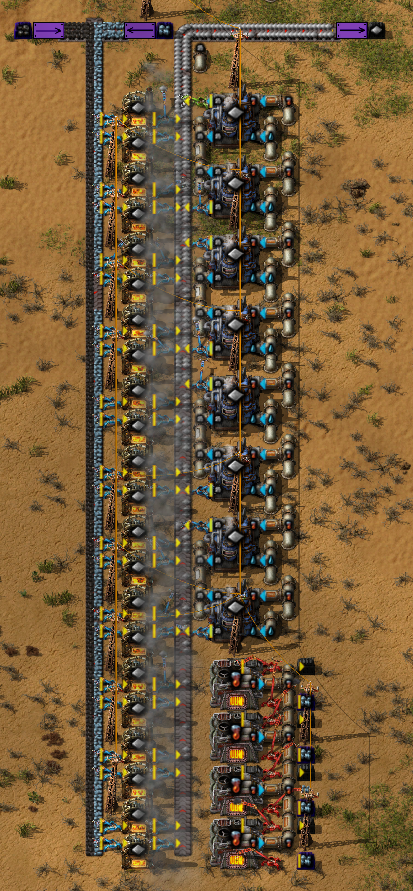

# A small Factorio mod which adds molten ores.

This Mod is written under Factorio 1.1.33.
It inserts its data in the data-updates stage.
The Steel and Electric Furnaces are replaced by this mods smelters which are Assembling Machine types.
This means that if other Mods add recipes for furnaces they won't be accessible.
There is a setting which disables the furnace replacement.
At he moment only "vanilla-ores" (iron and copper) are affected (modded ones are added over time).
If you want to add ores from other mods just take a look at mods/bz-mods.lua.

## Updates
* Initial release

## Known Issues
* None yet

## Languages
* english
* deutsch

## ToDo
* [ ] Balancing
* [x] better Icons
* [x] Techtree adjustments
* [x] Options/Settings
* [ ] Fluid Mixer
* [ ] Additional recipes (maybe)

## How to contribute?

Please use the Issues page and share your bugy, suggestions and/or code.
