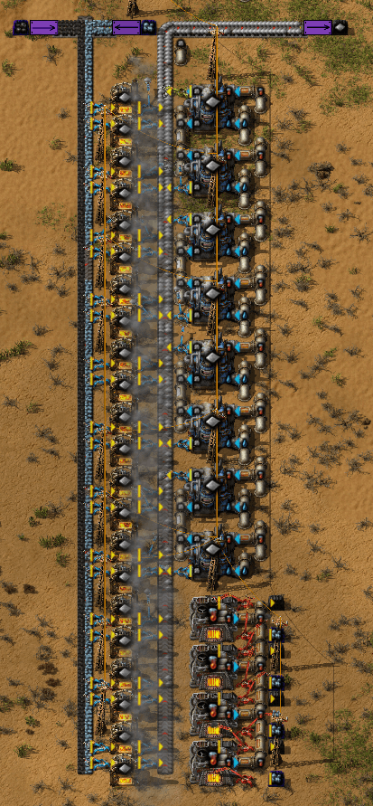

# A small Factorio mod which adds molten ores.
The Steel and Electric Furnaces are replaced by this mods smelters which are Assembling Machine types.
This means that if other Mods add recipes for furnaces they maybe won't be accessible.
There is a setting which disables the furnace replacement.
At the moment only "vanilla-ores" (iron and copper) and a few modded ones are affected.
If you want to add ores from other mods just take a look at mods/bz-mods.lua.

## Known Issues
* Uranium mechanic is bad

## Languages
* english
* deutsch

## ToDo
* [ ] Balancing
* [ ] Fluid Mixer
* [ ] ylib implementation

## How to contribute?
Please use the Issues page and share your bugy, suggestions and/or code.
